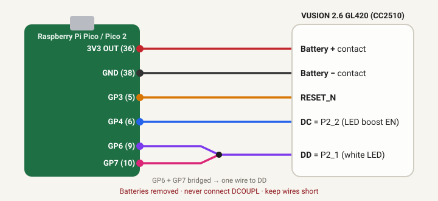

# MonopInk

**Put your own pictures on a SES-imagotag VUSION 2.6 BWR (GL420) e-ink shelf label.**

*[Version française → README.fr.md](README.fr.md)*

MonopInk takes over the label through the factory debug port of its
microcontroller (TI CC2510), using a Raspberry Pi Pico as the programmer. No
component is desoldered. Everything is done from a **web interface** (English /
French) or from the **command line**:

1. tell the app which Pico GPIOs you wired,
2. one click flashes the probe firmware on the Pico,
3. one click erases the locked store firmware and installs the MonopInk firmware,
4. drop any image, tune the conversion, preview it, send it,
5. or send pictures **from an Android phone over NFC**, without the Pico — the
   label's own NFC chip receives them, even on batteries ([docs/NFC.md](docs/NFC.md)).



---

## ⚠️ Read this first

- The original SES firmware is **read-protected** and will be **erased for good**
  (it cannot be backed up). The label will never work with the store system again.
  Only do this on a label you own.
- Power the label through its **battery contacts** (+ and −) from the Pico's 3V3,
  batteries removed. **Never** put 3.3 V on the CC2510 **DCOUPL** pin — it is the
  output of the internal 1.8 V regulator; feeding it destroys the chip.

## What you need

| | |
|---|---|
| Label | SES-imagotag **VUSION 2.6 BWR GL420** — TI CC2510F32, 152 × 296 black/white/red e-paper (IL0373 controller) |
| Programmer | **Raspberry Pi Pico** (RP2040) or **Pico 2** (RP2350) — W versions work too |
| Cable | a USB cable that carries **data** (many cheap cables are charge-only) |
| Tools | 5 thin wires (< 15 cm), fine soldering iron, ideally a multimeter |
| Computer | macOS, Linux or Windows with **Python 3.8+** (internet needed once, to install 2 Python packages) |

Nothing else: no Arduino IDE, no SDCC, no manual patching. Ready-made firmwares are included.

## Quick start

**macOS / Linux**

```bash
cd MonopInk
./monopink.sh
```

The first launch creates a private Python environment in `.venv/` (installs
`pyserial` and `Pillow`, nothing system-wide) and opens
<http://127.0.0.1:8420/> in your browser. On macOS you can also double-click
**`Start MonopInk.command`** (first time: right-click → Open).

**Windows**: double-click **`monopink.bat`** (install Python from
python.org first, ticking *“Add python.exe to PATH”*).

**Try it without hardware**: `./monopink.sh --sim` runs the whole workflow on a
simulated Pico + label.

Then follow the steps in the sidebar of the web page.

## Wiring

Default GPIOs (you can pick any others in the *Wiring* step — the pins are
stored in the Pico, nothing to recompile):

| Pico | Pico pin | Label (CC2510) | Where to solder |
|---|---|---|---|
| 3V3 OUT | 36 | **Battery +** | battery contact, batteries removed |
| GND | 38 | **Battery −** | battery contact |
| GP3 | 5 | **RESET_N** | CC2510 reset |
| GP4 | 6 | **DC** = P2_2 | shared with the LED boost converter enable (TPS61071): easy to reach there |
| GP6 + GP7 (bridged) | 9 + 10 | **DD** = P2_1 | shared with the white LED: easy to reach on the LED side |

- DD is bidirectional: the proven CCLib setup uses two GPIOs tied together
  (one reads, one drives) and a single wire to the label. A one-GPIO mode exists
  (tick *“DD on a single GPIO”*) but has not been validated on hardware yet.
- The Pico and the CC2510 are both 3.3 V: **no resistor, no level shifter**.
- Keep the wires short: entering debug mode is timing-sensitive.
- **Why the battery contacts and not DVDD?** Measured on a real GL420: the
  display is powered from the battery rail. With 3.3 V only on the CC2510's DVDD
  pin (as in the original log) the chip can be flashed and the display usually
  refreshes while the app is talking to the chip, but it does **not** refresh on
  its own (reset, batteries). On the battery contacts everything works. Check your
  wiring with *Tools → Test the autonomous start* (`./monopink.sh boot-test`).

## The web interface, step by step

1. **Before you start** — checklist and installation check.
2. **Wiring** — click a role (RESET, DC, DD) then a pin on the Pico drawing, or
   use the drop-downs. The connection table updates live.
3. **Pico probe** — plug the Pico and click *Install MonopInk firmware on the Pico*.
   If it already runs an Arduino-based firmware (e.g. CCLib_proxy) the app reboots
   it into BOOTSEL mode by itself; otherwise it asks you to hold BOOTSEL while
   plugging it in. The `.uf2` is copied, the Pico reboots, and your pins are
   saved in its flash. RP2040 and RP2350 are detected automatically.
4. **Label** — *Test the connection* reads the chip ID (0x81xx = CC2510), the
   debug lock and the installed firmware. A store label is locked: tick the
   confirmation and click *Erase & install*. The app mass-erases the chip (this
   clears the lock), writes the firmware + an orientation test card, **reads
   everything back to verify**, starts the label and **follows the display
   refresh live** (≈ 20 s for a 3-colour refresh).
5. **Picture** — drop / paste / choose an image (JPG, PNG, GIF, WebP, BMP…),
   choose portrait or landscape, framing (fill / fit / stretch), rendering:
   - *Dithering* — photos (black/white dithering, red only where the picture is red),
   - *Threshold* — logos, text, flat drawings,
   - *Levels* — dark → black, mid-tones → red, light → white,
   plus brightness, contrast, red sensitivity, invert, sharp resize, and
   *“enclosed white areas → red”*. The preview shows what the panel will display.
   *Send to the label* rewrites only the 11 KB picture area (a few seconds) and
   shows the refresh. You can also download the preview, a complete `.hex`
   (firmware + picture, for any CC programmer), the raw planes, or an
   `images.c` for the angrymew firmware.
6. **NFC (phone)** — checks the label's NFC chip, tests an NFC upload with the
   Pico playing the phone, and gives the link to the phone page (see
   [Pictures from a phone](#pictures-from-a-phone-nfc)).
7. **Tools & settings** — refresh again, **autonomous start test** (plain reset
   as on batteries, then checks that the label redrew its picture by itself),
   plain reset, flash dump, custom `.hex` firmware, serial port, language,
   **display calibration** (rotate 180° / mirror if the test card shows up the
   wrong way — not needed on the GL420 we tested).

The **Activity** bar at the bottom shows the log of every operation, with a
progress bar and a *Cancel* button.

When the refresh is finished the picture stays on the e-paper **without any
power**: unplug the Pico. With batteries, the label redraws the picture at each
power-up, then sleeps until a phone comes close (NFC).

## Pictures from a phone (NFC)

With the label firmware **1.3+**, an Android phone (Chrome) can replace the
picture through the label's NFC chip — no Pico, no computer, label on batteries.

1. **Publish the phone page once** — it must be served over `https://`. With
   GitHub: push this folder to a repository, then *Settings → Pages → Deploy from
   a branch → `main`, folder `/docs`*. The page is then at
   `https://<user>.github.io/<repository>/nfc/`. Paste that address in the web
   app (step *NFC (phone)*) to get a ready-made link for the phone.
2. **Check the label** — step *NFC (phone)*: *Check the NFC chip*, optionally
   *Test an NFC upload* (the Pico plays the phone), then *Phone mode* (or put the
   batteries in).
3. **On the phone** — open the page, pick a picture, adjust it (same settings as
   on the computer), press *Send* and tap the phone on the label once per part
   (1 tap for text/logos, 4–8 for dithered photos). The page guides every tap;
   the label refreshes ~20 s after the last one.

How it works, protocol, power use and limits: [docs/NFC.md](docs/NFC.md).
**Status:** complete and tested in simulation (the real firmware code, compiled
natively, driven by the phone page); **not yet validated on the real label**.

## Tested on real hardware

Label VUSION 2.6 BWR GL420 (CC2510F32, chip ID `0x8104`), Raspberry Pi Pico
(RP2040), macOS, default pins. Final wiring: 3V3 on the battery contacts.

| Step | Result |
|---|---|
| Pico running the original CCLib_proxy → detection, label info (compatibility mode) | ✔ |
| Probe firmware installed from the web page (automatic BOOTSEL reboot, copy, pins stored) | ✔ 7 s |
| Probe update over an existing MonopInk probe (CLI) | ✔ |
| Full 32 KB flash read, twice, identical, matching the previously flashed firmware | ✔ 4.5 s |
| Firmware + test card: 14 pages written **and verified** | ✔ 4.6 s |
| Picture from the web page / CLI: 11 pages written and verified | ✔ 3.6 s |
| Display refresh followed live (3-colour) | ✔ 19.6–19.7 s |
| Test card orientation and colours, custom landscape picture — checked by eye | ✔ no calibration needed |
| Autonomous start (plain reset, as on batteries), then PM3 sleep, then reconnection | ✔ 8/8 with firmware 1.2 |

Not tested on hardware: the NFC upload (firmware 1.3, see above), Pico 2 (RP2350), Windows, Linux, the single-GPIO DD mode,
and the mass erase of a truly locked chip (ours turned out to be already unlocked;
the erase path is exercised by the simulator and follows CCLib).

## Command line

Everything the web page does is available in a terminal (`./monopink.sh --help`,
`./monopink.sh <command> --help`). Add `--lang fr` for French messages, `--sim`
to use the simulator, `--port /dev/cu.usbmodemXXXX` to force a port.

```bash
./monopink.sh doctor                     # check Python, packages, firmware files
./monopink.sh ports                      # serial ports, BOOTSEL drives, probes and their pins
./monopink.sh pico-flash                 # install the probe firmware (default pins)
./monopink.sh pico-flash --rst 2 --dc 3 --dd-in 4 --dd-out 5
./monopink.sh pico-pins --dd 6           # change pins without reflashing (single-wire DD)
./monopink.sh info                       # chip ID, debug lock, installed firmware
./monopink.sh install                    # asks before erasing a locked chip
./monopink.sh install --erase --yes      # no questions
./monopink.sh image photo.jpg            # convert + send + follow the refresh
./monopink.sh image logo.png --mode threshold --fit contain --preview preview.png
./monopink.sh image cat.png --mode levels --fill-enclosed --orientation landscape
./monopink.sh test-pattern               # orientation test card
./monopink.sh config --rotate180 on      # display calibration
./monopink.sh run                        # redraw and follow the refresh
./monopink.sh boot-test                  # autonomous start test (as on batteries)
./monopink.sh reset                      # plain reset (normal boot)
./monopink.sh flash-hex blink.hex        # any Intel HEX firmware (--erase if locked)
./monopink.sh dump flash.bin             # read the 32 KB flash (unlocked chip)
./monopink.sh export photo.jpg --png p.png --hex label.hex --bin planes.bin --c images.c
./monopink.sh nfc-info                   # NFC chip diagnostic, wake-up mode on batteries
./monopink.sh nfc-send photo.jpg         # NFC upload test, the Pico playing the phone
./monopink.sh web --http-port 8420 --no-browser
```

Settings (pins, port, calibration, last conversion options) are stored in
`data/config.json` (`--sim` uses `data/sim/`, so trying things never touches
the real label's records).

## Troubleshooting

| Symptom | Cause / fix |
|---|---|
| *No probe found* | Charge-only USB cable; Pico not flashed yet (do the Pico step, it handles BOOTSEL); on Linux your user needs serial access: `sudo usermod -aG dialout $USER` (Arch: `uucp`) then log out/in. |
| BOOTSEL drive never appears | Hold BOOTSEL *before* plugging the USB cable, release after. Try another cable/port. On Linux the drive must be auto-mounted (most desktops do it; otherwise mount it under `/media/$USER/RPI-RP2`). |
| macOS: *“Disk not ejected properly”* | Normal: the Pico reboots right after receiving the firmware. |
| *The CC2510 does not answer* | No 3.3 V / ground on the battery contacts; RESET not wired; DD and DC swapped; wires too long; the pins set in the Pico differ from the real wiring (the app warns about it); batteries still in. |
| *Unexpected chip ID* | This is not a CC2510 label (other VUSION models use other chips). |
| *Verification failed* | Bad contact / long wires during the transfer: shorten the wires, redo the install. |
| *Refresh too short* | The firmware ran but the display never went busy: the panel flex cable is probably disconnected. |
| *Display did not power up* / autonomous start test fails | The display is not powered: feed 3.3 V to the **battery contacts** rather than DVDD; check the panel flex cable. |
| Chip reported *locked* by other tools | Right after entering debug mode the CC2510 reports `DEBUG_LOCKED` until the first debug instruction, even when it is not locked (measured). MonopInk tests the lock by executing an instruction; CCLib's `cc_info.py` does not, hence false alarms. |
| Picture upside down / mirrored | Tools → Display calibration (rotate 180° / mirror), then send again. |
| Speckled red | Use *Threshold* mode or lower the red sensitivity; thin red lines bleed on this panel. |
| Phone page: *Web NFC is not available* | Use Chrome on Android, over `https://`, with NFC on. Not possible on iPhone or a computer. |
| Phone page: *not a MonopInk label* | The label runs an older firmware: reinstall it (step *Label*, firmware 1.3+). |
| Phone page: *has not taken the last part yet* | The label is not powered (batteries?) or polls every 2 s (`nfc-info` shows the wake-up mode): move away, wait, tap again. |
| Phone page: *too complex* | More than 6 KB compressed: use *Threshold* / *Levels* or a simpler picture. |

## How it works (short version)

- **Pico = probe.** `pico/monopink_probe` is a CCLib_proxy-compatible firmware
  that bit-bangs TI's 2-wire debug protocol. MonopInk extensions: pins set over
  USB and stored in flash, block read/write (far fewer USB round-trips), reset
  and release of the lines, debug mode entered on demand. The CCLib_proxy
  protocol itself is kept.
- **Host tool** (`monopink/`, Python): talks to the probe, erases the chip,
  programs flash pages with a small 8051 routine executed from RAM (the method of
  TI SWRA124 / fishpepper — no DMA), verifies by reading back, converts images.
  It also works with a Pico running the *original* CCLib_proxy sketch (slower).
- **Label firmware** (`firmware/`, SDCC): at each boot, powers the panel, sends
  the picture stored at a **fixed flash address (0x5000)**, refreshes once, turns
  the panel off (deep sleep + supply cut) and puts the CC2510 in PM3. Because the
  picture has a fixed address, changing it only rewrites 11 flash pages — no
  compiler needed. The firmware reports its progress in RAM, which the app reads
  through the debug port to show the refresh live and diagnose the display.
  Between refreshes it sleeps until a phone's NFC field wakes it up, then
  receives a compressed picture through the NTAG chip ([docs/NFC.md](docs/NFC.md)).

Details: [docs/TECHNICAL.md](docs/TECHNICAL.md). The original hacking log (in
French) that this project packages: [docs/JOURNAL.fr.md](docs/JOURNAL.fr.md).

## Rebuilding the firmwares (optional)

Only needed if you modify them — ready-made files are in `firmware/prebuilt/`
and `pico/prebuilt/`.

```bash
brew install sdcc            # or: sudo apt install sdcc
firmware/build.sh --install  # -> firmware/prebuilt/monopink-tag.hex

pico/build.sh                # needs arduino-cli + the earlephilhower rp2040 core
                             # (found automatically inside Arduino IDE 2 on macOS)
```

Tests (no hardware needed): `.venv/bin/python -m unittest discover -s tests -v`
(the NFC tests also compile the label firmware natively with the system C
compiler and check the phone page's JavaScript with Node, when available).

## Project layout

```
MonopInk/
├── monopink.sh / monopink.bat / Start MonopInk.command   launchers
├── monopink/            Python package (CLI, web server, probe, CC2510, images, simulator)
│   └── web/static/      web interface (HTML/CSS/JS, EN + FR, works offline)
├── pico/                probe firmware (Arduino sketch) + prebuilt .uf2 (RP2040, RP2350)
├── firmware/            label firmware (C / SDCC) + prebuilt .hex, blink example
├── docs/                technical notes, NFC, original log, images
│   └── nfc/             phone page for NFC uploads (static, publish over https)
├── tests/               automated tests (simulator, protocol, web API, NFC + native firmware)
└── data/                created at run time: settings, last picture
```

## Credits & license

- [CCLib](https://github.com/wavesoft/CCLib) by Ioannis Charalampidis and
  Simon Schulz ([fishpepper](https://github.com/fishpepper)) — debug protocol and
  flash page routine, from which the probe firmware is derived.
- [angrymew/firmware-cc2510](https://github.com/angrymew/firmware-cc2510) and
  [andrei-tatar/imagotag-hack](https://github.com/andrei-tatar/imagotag-hack) —
  label pinout and display initialisation.
- [earlephilhower/arduino-pico](https://github.com/earlephilhower/arduino-pico) — RP2040/RP2350 Arduino core.

MonopInk is released under the **GNU GPL v3** (see `LICENSE`), like CCLib.
VUSION and SES-imagotag are trademarks of their owners; this project is not
affiliated with them.
